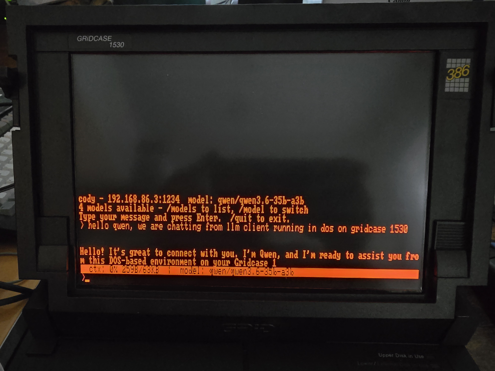
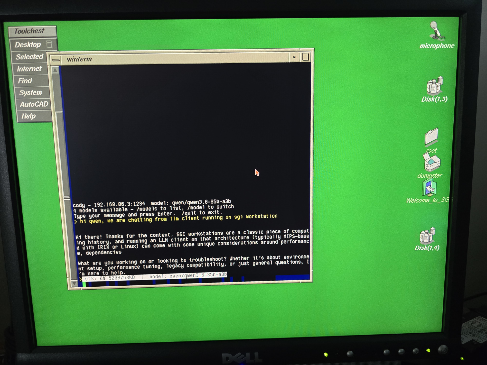

# Cody

There has been a great injustice in the world that needed fixing.
Potato computurs like MS-DOS or IRIX machines did not have an LLM client.
So, together with my trusty sidekick Claude, we embarked on a quest to fix it.
And the result is here. We proudly present Cody, an LLM client for potato computers.
Cody can be compiled for DOS, IRIX and even Linux.
Cody does not have dependencies, besides craving for attention.





## Building

| Platform | Directory | Prerequisite | Command |
|----------|-----------|--------------|---------|
| DOS      | `DOS/`    | OpenWatcom 1.9 (symlink as `WATCOM`) | `wmake` |
| IRIX     | `IRIX/`   | MIPSPro 7.4.4 | `smake` |
| Linux    | `LINUX/`  | gcc/make | `make` |

## Usage

```
cody [options]
  -h HOST   LLM server host
  -p PORT   LLM server port (default: 1234)
  -m MODEL  Model name (defaults to first available)
  -s SYSP   System prompt
```

## Slash Commands

| Command | Description |
|---------|-------------|
| `/help`, `/?` | Show help |
| `/models` | List available models |
| `/model <name>` | Switch to a model |
| `/compact` | Compact conversation history |
| `/reasoning` | Toggle reasoning mode |
| `/debug` | Toggle debug output |
| `/log` | Toggle conversation logging |
| `/quit`, `/exit` | Quit Cody |

## License & Authorship

Copyright (c) 2026, Dominik Behr, the laziest coder in the universe.
Licensed under the BSD 3-Clause License.
